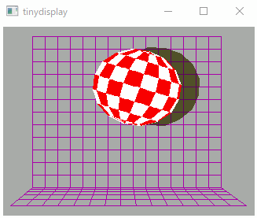
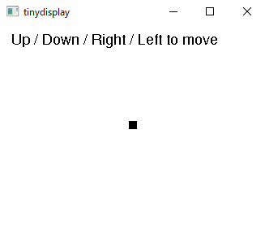
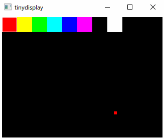

# tinydisplay

`tinydisplay` is a tiny display for TinyGo development.  
It is possible to simulate the input of buttons and touch input.  
tinydisplay works on windows, macOS and linux.   



`examples/buttons` is an example that handles button input.  



`examples/touch_paint` is an example of handling touch input.  



## Usage

First, run `./cmd/tinydisplay`.  
Next, control the display created by `NewClient()`.  
Some examples can be found in [./examples](./examples).  


```go
package main

import (
	"image/color"
	"time"

	"github.com/sago35/tinydisplay"
)

var (
	black = color.RGBA{0, 0, 0, 255}
	white = color.RGBA{255, 255, 255, 255}
)

func main() {
	display, _ := tinydisplay.NewClient("127.0.0.1", 9812, 320, 240)
	display.FillScreen(black)

	for x := int16(0); x < 100; x++ {
		display.SetPixel(x, x, white)
		display.SetPixel(x, 100-x-1, white)
	}
	for {
		time.Sleep(time.Hour)
	}
}
```

### Server

```
$ go build ./cmd/tinydisplay

$ ./tinydisplay.exe
tcp:127.0.0.1:9812
320x240
```

or

```
$ ./tinydisplay.exe --address localhost --port 3000 --size 640x480
tcp:localhost:3000
640x480
```


### Client

```
$ go run ./examples/basic

$ go run ./examples/displays

$ go run ./examples/pyportal_boing

$ go run ./examples/tinydraw

$ go run ./examples/unicode_font
```

### Examples

[./examples](./examples) will work with both tinydisplay and wioterminal.  
To make it work with tinydisplay, run `go-build`.  

```
$ go run ./examples/basic
```

If you want to run it using a target such as wioterminal, please run `tinygo flash`.  

```
$ tinygo flash --target wioterminal --size short ./examples/basic
```

## install

```shell
$ go install github.com/sago35/tinydisplay/cmd/tinydisplay@latest
```

```
$ GOPROXY=direct go install github.com/sago35/tinydisplay/cmd/tinydisplay@latest
```

## Author

sago35 - <sago35@gmail.com>
